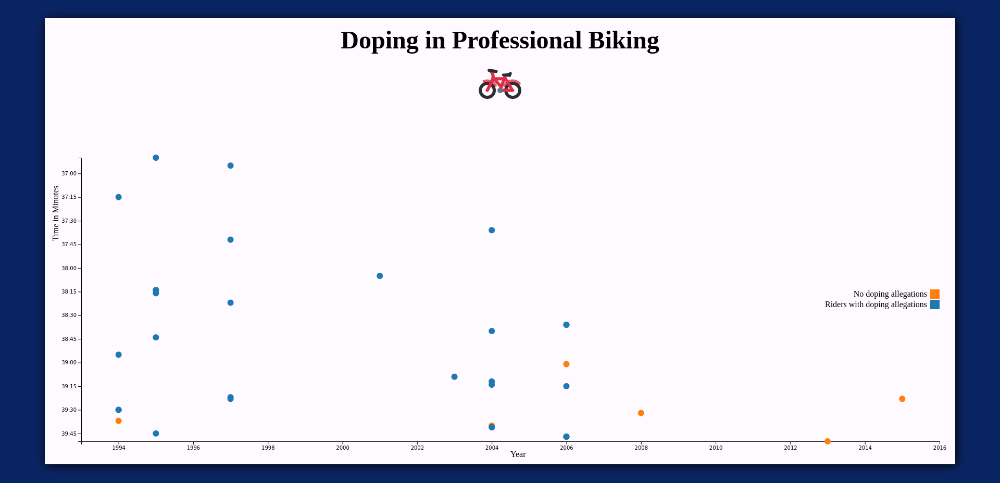

# Doping in Professional Biking

    

## Overview

    
This project is my personal solution of <a href="https://www.freecodecamp.org/" target="_blank">Freecodecamp's</a> second <a href="https://www.freecodecamp.org/learn/data-visualization/data-visualization-projects/visualize-data-with-a-scatterplot-graph" target="_blank">Data Visualization Challenge</a>.

    
This challenge required to display a scatter plot about doping allegations in professional biking competitions between 1994 and 2016.

## Skills

    
The following technologies were required to compelte this project

    <ul style="list-style-type: square;">
        <li><b>HTML</b></li>
        <li><b>CSS</b></li>
        <li><b>JS</b></li>
        <li><b>D3.js</b></li>
    </ul>

## Output

    
This is what the project should look like in the browser

    

## Copyright

    <blockquote>
        <a href="https://github.com/josewebdev2000">&copy; josewebdev2000</a> 2023
    </blockquote>

